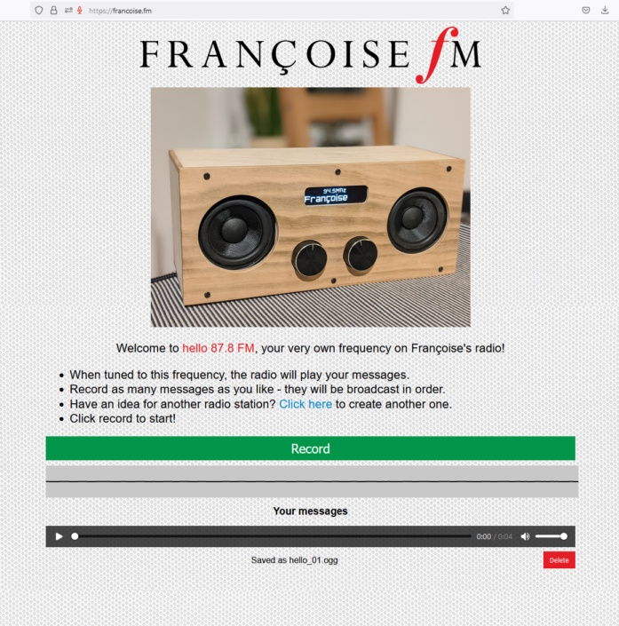

# Francoise FM

In 2022, as a gift for my mother's 70th birthday, I created a custom radio which allows her to tune into messages recorded by friends and family. The radio itself houses a Raspberry PI which connects to a server which hosts the audio data. Friends and family can follow the link to https://francoise.fm to create a radio station at a specific frequency and then leave as many messages as they want. Python code for the Raspberry PI is available in the radio/ directory. Java code for the server is available in the server/ directory. The wooden enclosure was handmade by my brother.

Copyright Alex Spurling 2022
